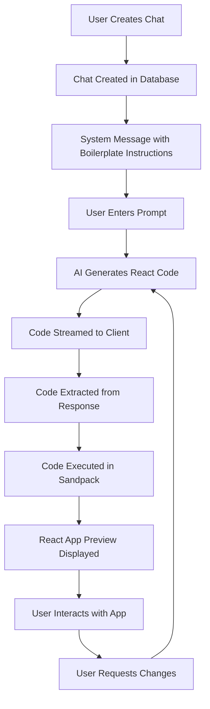

# Project Overview

This is a Next.js project called "Llama Coder". It's an open-source tool that allows users to generate small applications from a single prompt, using Llama 3.1 on Together.ai. The project uses a variety of technologies, including:

- **Framework:** Next.js (App Router)
- **Language:** TypeScript
- **Styling:** Tailwind CSS
- **LLM:** Llama 3.1 405B via Together.ai
- **Code Sandbox:** Sandpack
- **Database:** Prisma with Neon
- **Observability:** Helicone
- **Analytics:** Plausible

## Building and Running

### Development

To run the app in development mode, use the following command:

```bash
npm run dev
```

### Production

To build the app for production, use the following command:

```bash
npm run build
```

To start a production server, use the following command:

```bash
npm start
```

### Linting

To lint the code and check for TypeScript errors, use the following command:

```bash
npm run lint
```

## Development Conventions

- The project uses `eslint` and `prettier` for code formatting and linting.
- The project uses `prisma` for database migrations.
- The project uses `Sandpack` for the code sandbox.
- The project uses `Together.ai` for the LLM.
- The project uses `Helicone` for observability.
- The project uses `Plausible` for website analytics.

View this search on DeepWiki: <https://deepwiki.com/search/-please-analyze-this-github-re_ae94d71b-e60c-43c0-a842-1fe19b917319>

## Development Partnership and How We Should Partner

We build production code together. I handle implementation details while you guide architecture and catch complexity early.

### Core Workflow: Research → Plan → Implement → Validate

**Start every feature with:** "Let me research the codebase and create a plan before implementing."

1. **Research** - Understand existing patterns and architecture
2. **Plan** - Propose approach and verify with you
3. **Implement** - Build with tests and error handling
4. **Validate** - ALWAYS run formatters, linters, and tests after implementation

### Code Organization

**Keep functions small and focused:**

- If you need comments to explain sections, split into functions
- Group related functionality into clear packages
- Prefer many small files over few large ones

### Architecture Principles

**This is always a feature branch:**

- Delete old code completely - no deprecation needed
- No "removed code" or "added this line" comments - just do it

**Prefer explicit over implicit:**

- Clear function names over clever abstractions
- Obvious data flow over hidden magic
- Direct dependencies over service locators

### Maximize Efficiency

**Parallel operations:** Run multiple searches, reads, and greps in single messages
**Multiple agents:** Split complex tasks - one for tests, one for implementation
**Batch similar work:** Group related file edits together

### Problem Solving

**When stuck:** Stop. The simple solution is usually correct.

**When uncertain:** "Let me ultrathink about this architecture."

**When choosing:** "I see approach A (simple) vs B (flexible). Which do you prefer?"

Your redirects prevent over-engineering. When uncertain about implementation, stop and ask for guidance.

### Testing Strategy

**Match testing approach to code complexity:**

- Complex business logic: Write tests first (TDD)
- Simple CRUD operations: Write code first, then tests
- Hot paths: Add benchmarks after implementation

**Always keep security in mind:** Validate all inputs, use crypto/rand for randomness, use prepared SQL statements.

**Performance rule:** Measure before optimizing. No guessing.

### Progress Tracking

- **Use Todo lists** for task management
- **Clear naming** in all code

### Focus on maintainable solutions over clever abstractions

---
Generated using [Sidekick Dev]({REPO_URL}), your coding agent sidekick

Based on analyzing all the key files, here's a summary of the boilerplate structure and suggested enhancements:

1. **Current Boilerplate Structure**:

- Root layout (app/layout.tsx) handles metadata, analytics, and theme provider
- Main layout (app/(main)/layout.tsx) wraps content with providers and toaster
- Homepage (app/(main)/page.tsx) contains the main AI interface
- Uses modern Next.js 13+ App Router features
- Implements dark/light theme switching
- Includes analytics (Plausible)
- Has comprehensive error handling and loading states

## React App Initialization System: Comprehensive Technical Documentation

### Overview

This documentation explains the complete React app initialization and code generation system used by LlamaCoder. The system ensures that each chat session starts with a blank React app while maintaining a shared boilerplate structure across all chats.

## 1. Complete React App Initialization Flow

### 1.1 Chat Creation Process

When a new chat session begins, the system follows this initialization flow:

1. **Chat Creation** ([`app/(main)/actions.ts:12-180`](app/(main)/actions.ts:12))
   - A new chat record is created in the database with default settings
   - The chat is configured with `shadcn: true` to enable the component library
   - Initial system and user messages are populated

2. **System Message Setup** ([`app/(main)/actions.ts:157-162`](app/(main)/actions.ts:157))
   - A system message is created with the main coding prompt
   - This prompt establishes the React development environment constraints
   - The system message includes boilerplate instructions for React + TypeScript + Tailwind CSS

3. **Blank App State**
   - Each chat starts with no generated code
   - The code viewer remains hidden until the first assistant response
   - Users can begin typing prompts immediately

### 1.2 Initial State Management

The chat interface ([`app/(main)/chats/[id]/page.client.tsx:24-32`](app/(main)/chats/[id]/page.client.tsx:24)) manages the initial state:

```typescript
const [isShowingCodeViewer, setIsShowingCodeViewer] = useState(
  chat.messages.some((m) => m.role === "assistant"),
);
const [activeMessage, setActiveMessage] = useState(
  chat.messages.filter((m) => m.role === "assistant").at(-1),
);
```

## 2. Boilerplate Sharing Mechanism

### 2.1 Shared React Environment

The system uses a shared React boilerplate that is consistent across all chats:

1. **Template Configuration** ([`components/code-runner-react.tsx:21-55`](components/code-runner-react.tsx:21))
   - Uses Sandpack with `react-ts` template
   - Provides consistent TypeScript configuration
   - Includes shared dependencies and file structure

2. **Shared Dependencies** ([`components/code-runner-react.tsx:180-218`](components/code-runner-react.tsx:180))
   - All chats use the same dependency set: React, TypeScript, Tailwind CSS, Lucide React, Recharts, Framer Motion
   - Dependencies are defined once and reused across all code executions
   - Version consistency is maintained through the `customSetup` configuration

3. **Shadcn UI Components** ([`components/code-runner-react.tsx:115-178`](components/code-runner-react.tsx:115))
   - Pre-configured UI components are shared across all chats
   - Components are imported from the same paths in all generated code
   - Consistent styling and functionality across different chat sessions

### 2.2 File Structure Consistency

The boilerplate maintains a consistent file structure:

```typescript
const shadcnFiles = {
  "/lib/utils.ts": shadcnComponents.utils,
  "/components/ui/button.tsx": shadcnComponents.button,
  "/components/ui/input.tsx": shadcnComponents.input,
  // ... other shared components
};
```

## 3. Code Generation Process

### 3.1 AI-Powered Code Generation

The system uses AI to generate React code within the established boilerplate:

1. **Prompt Engineering** ([`lib/prompts.ts:29-126`](lib/prompts.ts:29))
   - The `getMainCodingPrompt` function creates context-aware system prompts
   - Includes detailed instructions for React + TypeScript + Tailwind CSS development
   - Provides Shadcn UI component documentation and usage examples

2. **Code Fence Processing** ([`lib/utils.ts:53-170`](lib/utils.ts:53))
   - The `splitByFirstCodeFence` function parses AI responses to extract code
   - Identifies the first code block in markdown responses
   - Extracts language, filename, and code content separately

3. **Streaming Code Generation** ([`app/(main)/chats/[id]/page.client.tsx:45-70`](app/(main)/chats/[id]/page.client.tsx:45))
   - Real-time streaming of AI responses
   - Automatic detection when code generation begins
   - Dynamic UI updates to show code as it's generated

### 3.2 Code Execution Context

When generating code, the AI operates within these constraints:

- **Language**: TypeScript only
- **Styling**: Tailwind CSS classes only (no arbitrary values)
- **Components**: Default to Shadcn UI when available
- **State Management**: Use React hooks (useState, useEffect) as needed
- **External APIs**: No external API calls allowed
- **Icons**: Limited to Lucide React icons from a predefined list

## 4. Execution and Preview System

### 4.1 Sandpack Integration

The system uses Sandpack for React code execution and preview:

1. **CodeRunner Component** ([`components/code-runner.tsx:8-17`](components/code-runner.tsx:8))
   - Delegates to `CodeRunnerReact` for all TypeScript/JavaScript code
   - Provides consistent execution environment across all chats
   - Handles code refresh and error states

2. **React Execution Environment** ([`components/code-runner-react.tsx:21-67`](components/code-runner-react.tsx:21))
   - SandpackProvider wraps the generated code
   - `App.tsx` is replaced with the generated code
   - Shared files (shadcn components, utils) remain constant

3. **Preview Configuration** ([`components/code-runner-react.tsx:56-63`](components/code-runner-react.tsx:56))
   - Full-screen preview with minimal UI controls
   - Auto-refresh disabled to maintain state during development
   - Error overlay with copy and fix functionality

### 4.2 Error Handling and Recovery

The system includes robust error handling:

1. **Error Detection** ([`components/code-runner-react.tsx:69-113`](components/code-runner-react.tsx:69))
   - Sandpack error detection and display
   - User-friendly error messages with copy functionality
   - "Try to fix" button for automatic error correction

2. **Error Recovery Flow** ([`app/(main)/chats/[id]/page.client.tsx:148-176`](app/(main)/chats/[id]/page.client.tsx:148))
   - Error messages are sent back to the AI for correction
   - New streaming session begins with error context
   - Maintains conversation history during recovery

## 5. Architecture Overview

### 5.1 End-to-End Flow

The complete flow from user input to running React app:



### 5.2 Data Model

The system uses a simple but effective data model ([`prisma/schema.prisma`](prisma/schema.prisma)):

- **Chat**: Represents a development session
- **Message**: Individual messages within a chat (system, user, assistant)
- **GeneratedApp**: Historical record of generated apps (legacy)

### 5.3 Key Components

1. **Chat Management** ([`app/(main)/actions.ts`](app/(main)/actions.ts))
   - Chat creation and message management
   - AI integration with Together AI
   - Prompt generation and title creation

2. **Code Processing** ([`lib/utils.ts`](lib/utils.ts))
   - Code extraction from markdown
   - Language and filename parsing
   - Streaming content processing

3. **UI Components** ([`app/(main)/chats/[id]/`](app/(main)/chats/[id]/))
   - Chat interface with real-time streaming
   - Code viewer with syntax highlighting
   - Preview system with error handling

4. **AI Integration** ([`app/api/get-next-completion-stream-promise/route.ts`](app/api/get-next-completion-stream-promise/route.ts))
   - Streaming AI responses
   - Context management (message history)
   - Model selection and configuration

## 6. System Benefits

### 6.1 Consistency

- All chats use the same React boilerplate
- Consistent coding standards and patterns
- Shared component library and styling

### 6.2 Efficiency

- Real-time code generation and preview
- Automatic error detection and recovery
- Streaming responses for immediate feedback

### 6.3 Developer Experience

- Clean separation between code generation and execution
- Rich error messages with actionable fixes
- Version control for generated code

## 7. Technical Implementation Details

### 7.1 Streaming Architecture

The system uses a streaming architecture for real-time code generation:

1. **Server-Side Streaming** ([`app/api/get-next-completion-stream-promise/route.ts:52-60`](app/api/get-next-completion-stream-promise/route.ts:52))
   - Together AI streaming responses
   - Edge runtime for optimal performance
   - Context-aware message handling

2. **Client-Side Streaming** ([`app/(main)/chats/[id]/page.client.tsx:45-87`](app/(main)/chats/[id]/page.client.tsx:45))
   - Real-time content updates
   - Dynamic UI state management
   - Automatic code viewer activation

### 7.2 Code Isolation

Each chat maintains its own code execution context:

- **Separate Sandpack Instances**: Each code preview runs in its own isolated environment
- **State Management**: Code state is maintained per chat session
- **Version Control**: Multiple versions of the same app can be compared

## Conclusion

The React app initialization system provides a robust, consistent, and efficient environment for AI-powered React development. By sharing a common boilerplate while maintaining session isolation, the system ensures that each chat starts with a blank React app while benefiting from a rich set of pre-configured tools and components. The streaming architecture and error handling capabilities create a seamless development experience for users.

I have completed a comprehensive analysis of the React boilerplate structure and code generation system in this project. Here's what I discovered:

## React Boilerplate Structure and Code Generation System

### 1. Initial React Boilerplate/Template Definition

The React boilerplate is defined in **[`lib/prompts.ts`](lib/prompts.ts:29)** through the [`getMainCodingPrompt()`](lib/prompts.ts:29) function. This function generates a comprehensive system prompt that includes:

- **Core Technology Stack**: React with TypeScript, Tailwind CSS, Shadcn UI, Lucide React icons, Framer Motion, and date-fns
- **Development Constraints**: No external API calls, single React component architecture, responsive design requirements
- **Shadcn UI Integration**: Pre-configured component library with 8 components (Avatar, Button, Card, Input, Label, RadioGroup, Select, Textarea)
- **Code Generation Format**: Uses `tsx{filename=component.tsx}` format for code blocks

### 2. How Each Chat Uses the Same Blank React App

The system ensures consistency through several mechanisms:

#### Database Schema

- **Chat Model**: Stores metadata including `shadcn: true` flag
- **Message Model**: Stores system messages with boilerplate content as position 0

#### Chat Initialization Process

In [`app/(main)/actions.ts`](app/(main)/actions.ts:12), the [`createChat()`](app/(main)/actions.ts:12) function:

1. Creates a new chat record with Shadcn enabled
2. Generates a title and matches similar examples
3. Initializes with a system message containing the boilerplate prompt:

   ```typescript
   {
     role: "system",
     content: getMainCodingPrompt(mostSimilarExample),
     position: 0,
   }
   ```

### 3. Boilerplate Sharing Mechanism

#### Centralized Prompt Management

- **[`lib/prompts.ts`](lib/prompts.ts)**: Contains all prompt logic and templates
- **[`lib/shadcn-docs/`](lib/shadcn-docs/)**: Houses Shadcn UI component documentation
- **[`lib/shadcn-examples.ts`](lib/shadcn-examples.ts)**: Provides reference examples

#### Dynamic Prompt Generation

The [`getMainCodingPrompt()`](lib/prompts.ts:29) function dynamically includes relevant examples based on user input similarity, ensuring consistent core instructions while allowing customization.

### 4. Code Execution and Preview System

#### Sandpack Integration

The system uses CodeSandbox's Sandpack for React code execution:

- **[`components/code-runner-react.tsx`](components/code-runner-react.tsx:21)**: Main execution engine with iframe-based sandboxing
- **Template**: React TypeScript template with pre-configured dependencies
- **File Structure**: User code injected as `App.tsx`, with shared Shadcn components

#### Security Measures

- **Iframe isolation**: Sandpack runs code in restricted iframes
- **Limited dependencies**: Pre-configured dependency list prevents arbitrary packages
- **No direct eval**: Uses Sandpack's compilation instead of direct `eval()`

#### Preview Configuration

- **[`components/code-runner-react.tsx`](components/code-runner-react.tsx:21)**: Main execution engine with iframe-based sandboxing
- **Template**: React TypeScript template with pre-configured dependencies
- **File Structure**: User code injected as `App.tsx`, with shared Shadcn components

#### Complete End-to-End Flow

1. **User creates chat** → Chat record created with system message containing boilerplate
2. **User enters prompt** → AI generates React code within established constraints
3. **Code streaming** → Real-time streaming of AI responses with code extraction
4. **Code execution** → Generated code runs in isolated Sandpack environment
5. **Preview display** → React app displayed with error handling and recovery

#### Key Technical Patterns

- **Streaming Architecture**: Real-time code generation with immediate feedback
- **Code Fence Processing**: Sophisticated regex-based extraction handles various code block formats
- **Version Control**: Built-in navigation through different code versions
- **Error Recovery**: Automatic error detection and correction capabilities

### 6. How the Same Blank React App is Shared

The system shares the same React boilerplate across all chats by:

1. **Template-based generation**: Each chat gets identical core instructions from [`getMainCodingPrompt()`](lib/prompts.ts:29)
2. **Dynamic component injection**: Full Shadcn UI documentation included in each system message
3. **Database storage**: Boilerplate stored as first message in each chat session
4. **Consistent execution environment**: All code runs in the same Sandpack configuration with identical dependencies

This approach ensures that every chat session starts with a blank React app while maintaining access to the same rich development environment, component library, and coding standards across all sessions.
The React app initialization system provides a robust, consistent, and efficient environment for AI-powered React development. By sharing a common boilerplate while maintaining session isolation, the system ensures that each chat starts with a blank React app while benefiting from a rich set of pre-configured tools and components. The streaming architecture and error handling capabilities create a seamless development experience for users.
